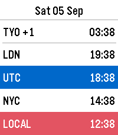

# Frequent Traveller

A Pebble watchface for people who live across timezones. The screen is a stack
of full-width colour bands, one per timezone:

- **Your local time** — always present, on a **red** band
- **UTC** — always present, on a **blue** band
- **Up to six extra zones** you configure — on the plain background

Bands are ordered **east to west by UTC offset**: every zone ahead of UTC sits
above the blue band, every zone behind it sits below, and the red local band
takes whatever position its own offset earns.

A configured zone that currently resolves to the **same offset as your local
zone or as UTC is hidden**, rather than drawn as a duplicate band — the
remaining rows just grow to fill the space.

The background is **white by default**; a dark theme is available in Settings.

A slim header carries just the date. Unlike the watchface this is modelled on,
there is deliberately **no time in the header** — local time already has a band
of its own.

Any row whose calendar date differs from your local date gets a `+1` / `-1`
suffix on its label.



## Requirements

These are the goals the watchface is built to, and the reference for whether a
change is correct.

| # | Requirement |
|---|-------------|
| 1 | The watchface **always shows a UTC row**, with a **blue** background. |
| 2 | The watchface **always shows the current (local) time row**, with a **red** background. |
| 3 | The watchface **allows additional timezones to be added**. |
| 4 | The watchface **background is white by default**. |
| 5 | **No time on the top bar.** Unlike the watchface this is modelled on, the header carries only the date. |
| 6 | **Rows must be in order**: all zones ahead of UTC above the UTC row, all zones behind UTC below it. |
| 7 | **Any timezone row matching current or UTC is hidden** from the list. |

Requirement 6 places the red local band by **its own offset**, not at a fixed
position — it sorts in among the other zones wherever its offset puts it.

Requirement 7 matches on the **live UTC offset**, not the IANA zone name. That
is what makes Lisbon collapse into the UTC band in winter and reappear as its
own band in summer. Matching on name instead would keep the row year-round and
show two identical clocks for half of it.

## Layout

The sort behind requirement 6 is stable, so zones sharing an offset keep the
order you configured them in.

Rows share the body of the screen evenly, so the type scales with how many
zones you've added — two rows get `GOTHIC_28_BOLD`, eight rows get
`GOTHIC_18_BOLD`. Band edges are interpolated across the full body height, which
spreads leftover pixels evenly and leaves no uncoloured seams between bands.

| Rows | Contents | Row height (emery) |
|------|----------|--------------------|
| 2 | local + UTC | 97 px |
| 5 | local + UTC + 3 zones (default) | 38 px |
| 8 | local + UTC + 6 zones (max) | 24 px |

Because of requirement 7, the row count can be lower than the number of zones
you configured.

Targets `emery` (Pebble Time 2, 200×228), `basalt` (Pebble Time, 144×168) and
`flint` (Pebble 2 Duo, 144×168). Layout is driven by `layer_get_bounds()`, so
both screen sizes are handled by the same code.

## Settings

Open the watchface's Settings from the Pebble app to configure:

- **Local timezone** (IANA zone, so DST is handled) and the label on the red row
- **12- / 24-hour clock**
- **Dark background**
- **Extra timezones** — up to six, each with a custom label

### How timezones actually work here

The watch has no IANA timezone database and no DST rules. It only ever stores a
fixed **UTC offset in minutes** per zone. The phone resolves IANA names to
current offsets and ships those numbers down over AppMessage.

That resolution happens in the **config page's webview**, not in pkjs — the
Pebble emulator's JS host (`pypkjs`) crashes with a fatal OOM on
`Intl.DateTimeFormat` construction, so `src/pkjs/index.js` avoids `Intl`
entirely and only forwards numbers. Offsets refresh whenever you save Settings.

## Development

Dependencies come from Nix; [direnv](https://direnv.net/) loads them on `cd`:

```sh
direnv allow          # or: nix develop
uv tool install pebble-tool   # first time only
```

The dev shell also points `DYLD_LIBRARY_PATH` at a Nix `libpng` on macOS,
because the SDK's prebuilt `qemu-pebble` links against a hardcoded Homebrew
path for `libpng16`.

```sh
pebble build                                    # -> build/frequent-traveller-watchface.pbw
pebble install --emulator emery                 # run in QEMU
pebble screenshot --no-open --emulator emery out.png
pebble install --cloudpebble                    # deploy to a real watch
```

The emulator persists its flash between runs, including the previously active
watchface. If an install appears to succeed but the old face is still on screen,
`pebble wipe` (with the emulator stopped) clears it.

Note that in the emulator, pkjs derives the initial local offset from
`Date.getTimezoneOffset()`, which `pypkjs` reports without DST — so local time
can be an hour off until you save Settings once. Real phones resolve it
correctly.

## Files

```
src/c/main.c            watchface: row model, band layout, drawing, AppMessage
src/pkjs/index.js       phone companion: config persistence + AppMessage fan-out
src/pkjs/config-page.js the Settings page (HTML string, resolves IANA -> offset)
```

## Credits

Design inspired by David Macías'
[Multi Timezone with Date](https://github.com/david-macias/Multi-Timezone-with-Date-Pebble-Watchface).
